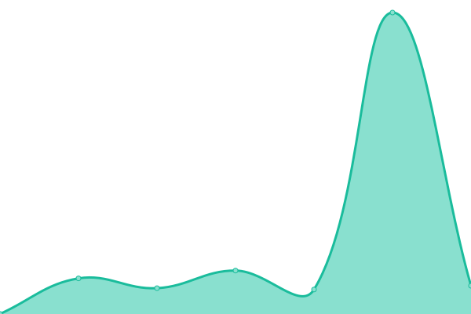
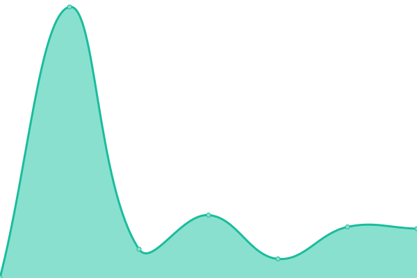
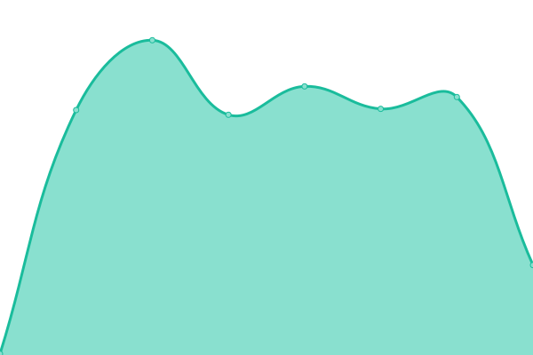

# [📈 Live Status](https://demo.upptime.js.org): <!--live status--> **🟧 Partial outage**

This repository contains the open-source uptime monitor and status page for [Ceccun](https://ceccun.com), powered by [Upptime](https://github.com/upptime/upptime).

With [Upptime](https://upptime.js.org), you can get your own unlimited and free uptime monitor and status page, powered entirely by a GitHub repository. We use [Issues](https://github.com/stel-la/status/issues) as incident reports, [Actions](https://github.com/stel-la/status/actions) as uptime monitors, and [Pages](https://demo.upptime.js.org) for the status page.

<!--start: status pages-->
<!-- This summary is generated by Upptime (https://github.com/upptime/upptime) -->
<!-- Do not edit this manually, your changes will be overwritten -->
<!-- prettier-ignore -->
| URL | Status | History | Response Time | Uptime |
| --- | ------ | ------- | ------------- | ------ |
|  [API](https://api.ceccun.com/cdynamic/captive) | 🟥 Down | [api.yml](https://github.com/ceccun/status/commits/HEAD/history/api.yml) | 

 0ms
     
 | 

<a href="https://status.ceccun.com/history/api">0.00%</a>
    

|  [CDN](https://cdn.ceccun.com/cdynamic/captive) | 🟥 Down | [cdn.yml](https://github.com/ceccun/status/commits/HEAD/history/cdn.yml) | 

 15485ms
     
 | 

<a href="https://status.ceccun.com/history/cdn">56.33%</a>
    

|  [Front-end](https://ceccun.com) | 🟩 Up | [front-end.yml](https://github.com/ceccun/status/commits/HEAD/history/front-end.yml) | 

 105ms
     
 | 

<a href="https://status.ceccun.com/history/front-end">100.00%</a>
    

|  [Search](https://bettersearch.ejaz4.repl.co/) | 🟩 Up | [search.yml](https://github.com/ceccun/status/commits/HEAD/history/search.yml) | 

 4950ms
     
 | 

<a href="https://status.ceccun.com/history/search">98.32%</a>
    

<!--end: status pages-->

[**Visit our status website →**](https://demo.upptime.js.org)

## 📄 License

- Powered by: [Upptime](https://github.com/upptime/upptime)
- Code: [MIT](./LICENSE) © [Ceccun](https://ceccun.com)
- Data in the `./history` directory: [Open Database License](https://opendatacommons.org/licenses/odbl/1-0/)
