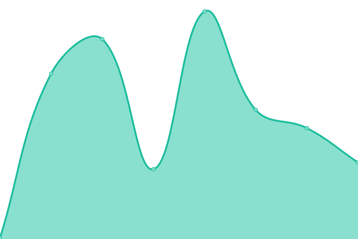
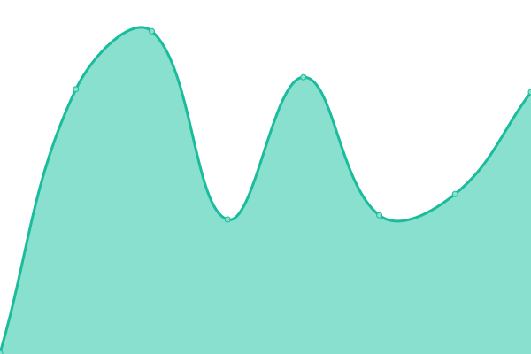

# [📈 Live Status](https://demo.upptime.js.org): <!--live status--> **🟩 All systems operational**

This repository contains the open-source uptime monitor and status page for [Ceccun](https://ceccun.com), powered by [Upptime](https://github.com/upptime/upptime).

With [Upptime](https://upptime.js.org), you can get your own unlimited and free uptime monitor and status page, powered entirely by a GitHub repository. We use [Issues](https://github.com/stel-la/status/issues) as incident reports, [Actions](https://github.com/stel-la/status/actions) as uptime monitors, and [Pages](https://demo.upptime.js.org) for the status page.

<!--start: status pages-->
<!-- This summary is generated by Upptime (https://github.com/upptime/upptime) -->
<!-- Do not edit this manually, your changes will be overwritten -->
<!-- prettier-ignore -->
| URL | Status | History | Response Time | Uptime |
| --- | ------ | ------- | ------------- | ------ |
|  [Ceccun](https://ceccun.com) | 🟩 Up | [ceccun.yml](https://github.com/ceccun/status/commits/HEAD/history/ceccun.yml) | 

 183ms
     
 | 

<a href="https://status.ceccun.com/history/ceccun">100.00%</a>
    

|  [Zen Platform](https://uowbo.ceccun.com) | 🟩 Up | [zen-platform.yml](https://github.com/ceccun/status/commits/HEAD/history/zen-platform.yml) | 

 494ms
     
 | 

<a href="https://status.ceccun.com/history/zen-platform">100.00%</a>
    

|  [Stella Search](https://stella.hs.vc/) | 🟩 Up | [stella-search.yml](https://github.com/ceccun/status/commits/HEAD/history/stella-search.yml) | 

 280ms
     
 | 

<a href="https://status.ceccun.com/history/stella-search">100.00%</a>
    

|  [Experiments](http://insecure.psychic-couscous.labs.ceccun.com/) | 🟩 Up | [experiments.yml](https://github.com/ceccun/status/commits/HEAD/history/experiments.yml) | 

 334ms
     
 | 

<a href="https://status.ceccun.com/history/experiments">100.00%</a>
    

<!--end: status pages-->

[**Visit our status website →**](https://demo.upptime.js.org)

## 📄 License

- Powered by: [Upptime](https://github.com/upptime/upptime)
- Code: [MIT](./LICENSE) © [Ceccun](https://ceccun.com)
- Data in the `./history` directory: [Open Database License](https://opendatacommons.org/licenses/odbl/1-0/)
